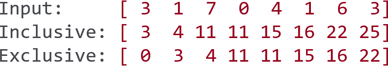
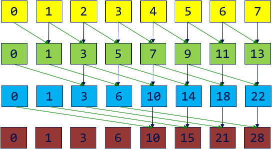
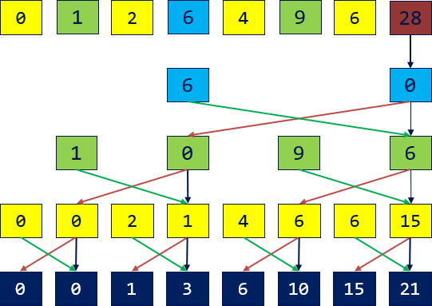
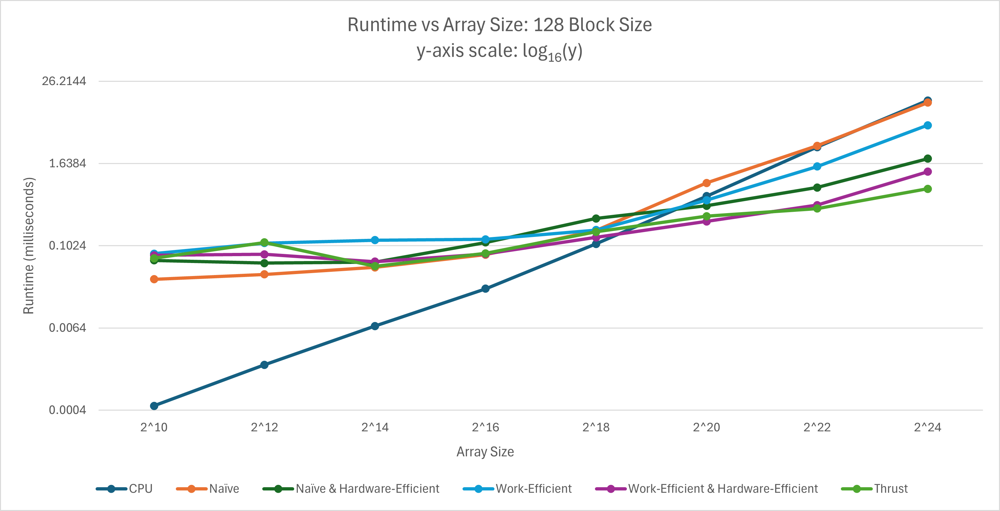

CUDA Stream Compaction
======================

**University of Pennsylvania, CIS 565: GPU Programming and Architecture, Project 2**

* Michael Rabbitz
  * [LinkedIn](https://www.linkedin.com/in/mike-rabbitz)
* Tested on: Windows 10, i7-9750H @ 2.60GHz 32GB, RTX 2060 6GB (Personal)

## Part 1: Introduction

This project implements various Stream Compaction algorithms, with an emphasis on those utilizing the Scan algorithm, to highlight the importance of designing GPU hardware-optimized algorithms that leverage parallel computation for superior performance compared to CPU implementations.

### Stream Compaction
Stream compaction involves filtering an input data set to produce a new collection that contains only the elements meeting a specified condition, while preserving their original order. This process reduces the size of the data set by removing unwanted elements, which is crucial for optimizing performance and memory usage in applications like path tracing, collision detection, etc.

<p align="left">
  
</p>

### Scan
The Scan algorithm, also known as the all-prefix-sums operation, computes prefix sums for an array of data. In an exclusive scan, each element in the result is the sum of all preceding elements in the input array. Conversely, an inclusive scan includes the current element in the sum. Scan algorithms are fundamental in parallel computing for tasks like sorting, stream compaction, and building data structures, as they transform inherently sequential computations into parallel ones.

<p align="left">
  
</p>

## Part 2: Implementation Details

**All implementations support arrays of arbitrary size**

### Scan
#### Implementations
1. **CPU:**  O(n) addition operations - sequential loop over array elements, accumulating a sum at each iteration
2. **GPU Naive Algorithm:**  O(n * log<sub>2</sub>(n)) addition operations - over log<sub>2</sub>(n) passes, for pass p starting at p = 1, compute the partial sums of n - 2<sup>p - 1</sup> elements in parallel
3. **GPU Work-Efficient Algorithm:**  O(n) operations - performs scan into two phases: parallel upsweep (reduction) with n - 1 adds (O(n)), and parallel downsweep with n - 1 adds (O(n)) and n - 1 swaps (O(n))
4. **GPU Naive Algorithm with Hardware Efficiency:**  uses shared memory - divide the array into blocks, then scan each block in parallel over many SMs (with each block corresponding to a thread block). Utilize shared memory within each thread block to perform the scan and write the total sum of each block to a new array of block sums. Scan the array of block sums to compute an array of block increments, which are then added to each element in the corresponding scanned block from the initial scan (e.g. the zero-indexed block increment from the block increments array is added to each element in the zero-indexed scanned block of the divided input array).
5. **GPU Work-Efficient Algorithm with Hardware Efficiency:**  uses shared memory - same process as above
6. **GPU using [Thrust CUDA library](https://nvidia.github.io/cccl/thrust):**  wrapper function using thrust::exclusive_scan

|Inclusive Scan - GPU Naive Algorithm|
|:--:|
||

|Exclusive Scan - GPU Work-Efficient Algorithm|
|:--:|
|Upsweep <tr></tr>|
| <tr></tr>|
|Downsweep <tr></tr>|
||

|Inclusive Scan - GPU with Hardware Efficiency using shared memory|
|:--:|
||

### Stream Compaction
**For this project, Stream Compaction is performed on an array of randomized non-negative integers, where elements with a value of 0 are considered "invalid elements" and those with positive values are deemed "valid elements."**

#### Stream Compaction with Scan is described in 3 steps:
1. **Create Binary Map:** use the input array to create a binary map array indicating the validity of each input element
2. **Scan:** perform Scan on the binary array to generate a map of index values which correspond to the compacted array index of sequential valid input elements
3. **Scatter:** for the indices of the binary array that indicate valid input elements - use a given binary array index to index the input array to get the valid element data, and use the same index to index the Scan output array to get the compacted array index of the valid element. Use these two values to place the valid element data into the compacted array

<p align="left">
  
</p>

#### Implementations
1. **CPU without Scan:** - sequential loop over input elements while placing valid input data into the compacted array
2. **CPU with Scan:** - perform Step 1 with sequential loop over n elements, perform Step 2 using CPU Scan, then perform Step 3 with sequential loop over n elements
3. **GPU with Work-Efficient Scan:** - perform Step 1 over n elements in one parallel pass, perform Step 2 using Work-Efficient Scan, then perform Step 3 over n elements in one parallel pass
4. **GPU with Work-Efficient and Hardware-Efficient Scan:** - same as above line except using Work-Efficient and Hardware-Efficient Scan
5. **GPU using [Thrust CUDA library](https://nvidia.github.io/cccl/thrust):**  wrapper function using thrust::remove_if

## Part 3: Performance Analysis
### Optimal Block Size
**For each GPU Scan implementation, find the block size that gives the minimal runtime on the GPU**

**Each data point is the average of 100 runtime samples**
<p align="left">
  
</p>

| Block Size | Naive (ms) | Naive & Hardware-Eff (ms) | Work-Eff | Work-Eff & Hardware-Eff |
| ---------- | ---------- | ------------------------- | -------- | ----------------------- |
|32          |191.8       |24                         |47.6      |13.1                     |
|64          |116.9       |14.4                       |47.9      |9.7                      |
|128         |116.8       |13.8                       |47.4      |9.3                      |
|256         |116.8       |14                         |47.8      |9.6                      |
|512         |116.8       |14.4                       |48.3      |10.5                     |
|1024        |118.1       |16.6                       |50.4      |12.4                     |

Based on the results, it is clear that block size of 128 is optimal.

### Runtime
**Includes the CPU Scan implementation, all GPU Scan implementations, and the Thrust Scan**

**Each data point is the average of 100 runtime samples**
<p align="left">
  
</p>

|  Array Size  | CPU (ms) | Naive (ms)  | Naive & Hardware-Eff (ms)  | Work-Eff  | Work-Eff & Hardware-Eff  | Thrust (ms)  |
| ------------ | -------- |------------ | -------------------------- | --------- | ------------------------ | ------------ |
|2<sup>10</sup>|0.0005    |0.0332       |0.0626                      |0.0786     |0.0742                    |0.0670        |
|2<sup>12</sup>|0.0018    |0.0390       |0.0570                      |0.1122     |0.0766                    |0.1143        |
|2<sup>14</sup>|0.0068    |0.0494       |0.0589                      |0.1236     |0.0598                    |0.0514        |
|2<sup>16</sup>|0.0241    |0.0756       |0.1145                      |0.1271     |0.0776                    |0.0793        |
|2<sup>18</sup>|0.1092    |0.1705       |0.2576                      |0.1742     |0.1362                    |0.1640        |
|2<sup>20</sup>|0.5457    |0.8490       |0.3955                      |0.4744     |0.2322                    |0.2773        |
|2<sup>22</sup>|2.8498    |2.9690       |0.7290                      |1.4791     |0.4043                    |0.3592        |
|2<sup>24</sup>|13.7399   |12.8068      |1.9275                      |5.9673     |1.2438                    |0.6996        |

Based on the results, we see that the CPU implementation is the fastest up to array size 2<sup>18</sup>.
As array size continues to increase past this, all of the GPU algorithms besides Naive get relatively exponentially faster.
Work-Efficient, although much better than CPU and Naive, does itself start to have exponentially longer run times as we get to very large sizes.
The Naive & Hardware-Efficient Scan and Work-Efficient & Hardware-Efficient Scan both exemplify the signficance of using shared memory best practices (no bank conflicts) and warp partitioning.
Thrust clearly starts to pull away as we get to the largest array sizes, but I am proud of how my Work-Efficient & Hardware-Efficient Scan gives it a run for its money!


### Performance Bottlenecks

The Work-Efficient Scan is clearly faster than the Naive Scan since there is less overall work to do as described in the implementation details in the [Part 2](#part-2-implementation-details) Scan section.
However, since they both have a vast amount of read and write operations from/to global memory, they both perform poorly relative to the Hardware-Efficient implementations that use shared memory.
Another inefficiency of the Naive Scan is the absense of warp partitioning best practices, which the rest of the GPU Scan implementations utilize. Warp paritioning is how threads from a block are divided into warps, and the goal is to partition based on consecutive increasing thread indices such that divergent branches are minimized and warps are retired early, freeing up resources for the GPU to perform any other available work with.
Lastly, since the Naive & Hardware-Efficient and Work-Efficient & Hardware-Efficient implementations are optimized with shared memory and warp paritioning best practices, another bottleneck comes into play called bank conflicts. Shared memory is split up into 32 banks such that each bank can service one address per cycle. This was not a problem when implementing the Naive & Hardware-Efficient Scan, but was introduced in the initial implementation stages of the Work-Efficient & Hardware-Efficient Scan. Through adding a padding element after every 32 shared memory elements, the bank conflicts were alleviated and performance increased.

### Sample Output
This output is used to test the correctness and timing of all Scan and Stream Compaction implementations.

In this sample, Array Size of 2<sup>20</sup> is used.

```
****************
** SCAN TESTS **
****************
    [  12  47  23   8  49  44  11   3  48  22  33   4  12 ...  31   0 ]
==== cpu scan, power-of-two ====
    [   0  12  59  82  90 139 183 194 197 245 267 300 304 ... 25666918 25666949 ]
   elapsed time: 0.6517ms    (std::chrono Measured)
==== cpu scan, non-power-of-two ====
    [   0  12  59  82  90 139 183 194 197 245 267 300 304 ... 25666812 25666855 ]
   elapsed time: 0.5208ms    (std::chrono Measured)
    passed
==== naive scan, power-of-two, no shared memory ====
   elapsed time: 1.07728ms    (CUDA Measured)
    passed
==== naive scan, non-power-of-two, no shared memory ====
   elapsed time: 0.843456ms    (CUDA Measured)
    passed
==== naive scan, power-of-two, shared memory ====
   elapsed time: 0.49872ms    (CUDA Measured)
    passed
==== naive scan, non-power-of-two, shared memory ====
   elapsed time: 0.477088ms    (CUDA Measured)
    passed
==== work-efficient scan, power-of-two, no shared memory ====
   elapsed time: 0.566848ms    (CUDA Measured)
    passed
==== work-efficient scan, non-power-of-two, no shared memory ====
   elapsed time: 0.468896ms    (CUDA Measured)
    passed
==== work-efficient scan, power-of-two, shared memory ====
   elapsed time: 0.216576ms    (CUDA Measured)
    passed
==== work-efficient scan, non-power-of-two, shared memory ====
   elapsed time: 0.2104ms    (CUDA Measured)
    passed
==== thrust scan, power-of-two ====
   elapsed time: 0.621248ms    (CUDA Measured)
    passed
==== thrust scan, non-power-of-two ====
   elapsed time: 0.183968ms    (CUDA Measured)
    passed

*****************************
** STREAM COMPACTION TESTS **
*****************************
    [   0   1   1   0   1   0   3   3   0   0   3   0   0 ...   1   0 ]
==== cpu compact without scan, power-of-two ====
   elapsed time: 2.4059ms    (std::chrono Measured)
    [   1   1   1   3   3   3   1   1   1   3   1   3   1 ...   3   1 ]
    passed
==== cpu compact without scan, non-power-of-two ====
   elapsed time: 2.4662ms    (std::chrono Measured)
    [   1   1   1   3   3   3   1   1   1   3   1   3   1 ...   3   2 ]
    passed
==== cpu compact with scan, power-of-two ====
   elapsed time: 4.6895ms    (std::chrono Measured)
    passed
==== cpu compact with scan, non-power-of-two ====
   elapsed time: 5.1045ms    (std::chrono Measured)
    passed
==== work-efficient compact, power-of-two, no shared memory ====
   elapsed time: 1.39776ms    (CUDA Measured)
    passed
==== work-efficient compact, non-power-of-two, no shared memory ====
   elapsed time: 0.817856ms    (CUDA Measured)
    passed
==== work-efficient compact, power-of-two, shared memory ====
   elapsed time: 0.602912ms    (CUDA Measured)
    passed
==== work-efficient compact, non-power-of-two, shared memory ====
   elapsed time: 0.588288ms    (CUDA Measured)
    passed
==== thrust compact, power-of-two ====
   elapsed time: 0.28656ms    (CUDA Measured)
    passed
==== thrust compact, non-power-of-two ====
   elapsed time: 0.283488ms    (CUDA Measured)
    passed
```
