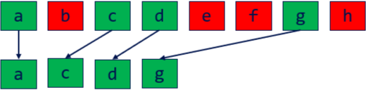

CUDA Stream Compaction
======================

**University of Pennsylvania, CIS 565: GPU Programming and Architecture, Project 2**

* Michael Rabbitz
  * [LinkedIn](https://www.linkedin.com/in/mike-rabbitz)
* Tested on: Windows 10, i7-9750H @ 2.60GHz 32GB, RTX 2060 6GB (Personal)

## Part 1: Introduction

This project focuses on implementing various Stream Compaction algorithms, including those utilizing the Scan algorithm, to emphasize the importance of designing GPU hardware-optimized algorithms that leverage parallel computation for superior performance compared to CPU implementations.

### Stream Compaction
Stream compaction involves filtering an input data set to produce a new collection that contains only the elements meeting a specified condition, while preserving their original order. This process reduces the size of the data set by removing unwanted elements, which is crucial for optimizing performance and memory usage in applications like path tracing, collision detection, etc.

  

### Scan
The Scan algorithm, also known as the all-prefix-sums operation, computes prefix sums for an array of data. In an exclusive scan, each element in the result is the sum of all preceding elements in the input array. Conversely, an inclusive scan includes the current element in the sum. Scan algorithms are fundamental in parallel computing for tasks like sorting, stream compaction, and building data structures, as they transform inherently sequential computations into parallel ones.

  

## Part 2: Implementation Details

**n represents the number of elements in the array**

**All implementations support arrays of arbitrary n - small, large, powers of two, not powers of two**

### Scan
#### Implementations
1. **CPU:**  O(n) addition operations - sequential loop over array elements, accumulating a sum at each iteration
2. **GPU Naive Algorithm:**  O(n * log2(n)) addition operations - over log2(n) passes, for pass p starting at p = 1, compute the partial sums of n - 2p - 1 elements in parallel
3. **GPU Work-Efficient Algorithm:**  O(n) operations - performs scan into two phases: parallel upsweep (reduction) with n - 1 adds (O(n)), and parallel downsweep with n - 1 adds (O(n)) and n - 1 swaps (O(n))
4. **GPU Naive Algorithm with Hardware Efficiency:**  shared memory - divide the array into evenly-sized blocks, each of which is scanned by a single thread block. Utilize shared memory within each thread block to perform the scan and write the total sum of each block to a separate array of block sums. Then, scan the array of block sums to create an array of block increments, which are added to all elements within their respective blocks.
5. **GPU Work-Efficient Algorithm with Hardware Efficiency:**  shared memory - same process as above
6. **GPU using [Thrust CUDA library](https://nvidia.github.io/cccl/thrust):**  wrapper function using thrust::exclusive_scan

#### Inclusive Scan - GPU Naive Algorithm:

  

#### Exclusive Scan - GPU Work-Efficient Algorithm:
**Upsweep**

  

**Downsweep**

  

### Stream Compaction
**Compaction removes invalid elements (0s) from an array of randomized ints**

#### Stream Compaction with Scan is described in 3 steps:
1. **Create Binary Map:** use the input array to create a binary map array indicating the validity of each input element
2. **Scan:** perform Scan on the binary array to generate a map of index values which correspond to the compacted array index of sequential valid input elements
3. **Scatter:** for the indices of the binary array that indicate valid input elements, use those indices to index the Scan output array to determine the compated array index of the valid element, then place valid element data into the compacted array

  

#### Implementations
1. **CPU without Scan:** - sequential loop over input elements while placing valid input data into the compacted array
2. **CPU with Scan:** - perform Step 1 with sequential loop over n elements, perform Step 2 using CPU Scan, then perform Step 3 with sequential loop over n elements
3. **GPU with Work-Efficient Scan:** - perform Step 1 over n elements in one parallel pass, perform Step 2 using Work-Efficient Scan, then perform Step 3 over n elements in one parallel pass
4. **GPU with Work-Efficient and Hardware-Efficient Scan:** - same as above line except using Work-Efficient and Hardware-Efficient Scan
5. **GPU using [Thrust CUDA library](https://nvidia.github.io/cccl/thrust):**  wrapper function using thrust::remove_if

## Part 3: Performance Analysis
### Optimal Block Size
**For each GPU Scan implementation, find the block size that gives the minimal runtime on the GPU**

**Each data point is the average of 100 runtime samples**

  

| Block Size | Naive (ms) | Naive & Hardware-Eff (ms) | Work-Eff | Work-Eff & Hardware-Eff |
| ---------- | ---------- | ------------------------- | -------- | ----------------------- |
|32          |191.8       |24                         |47.6      |13.1                     |
|64          |116.9       |14.4                       |47.9      |9.7                      |
|128         |116.8       |13.8                       |47.4      |9.3                      |
|256         |116.8       |14                         |47.8      |9.6                      |
|512         |116.8       |14.4                       |48.3      |10.5                     |
|1024        |118.1       |16.6                       |50.4      |12.4                     |

Based on the results, it is clear that block size of 128 is optimal.

### Runtime
**This includes the CPU Scan implementation, the GPU Scan implementations, and the Thrust Scan**

**Each data point is the average of 100 runtime samples**

  

**Look at Thrust Implementation**

### Performance Bottlenecks

### Output

